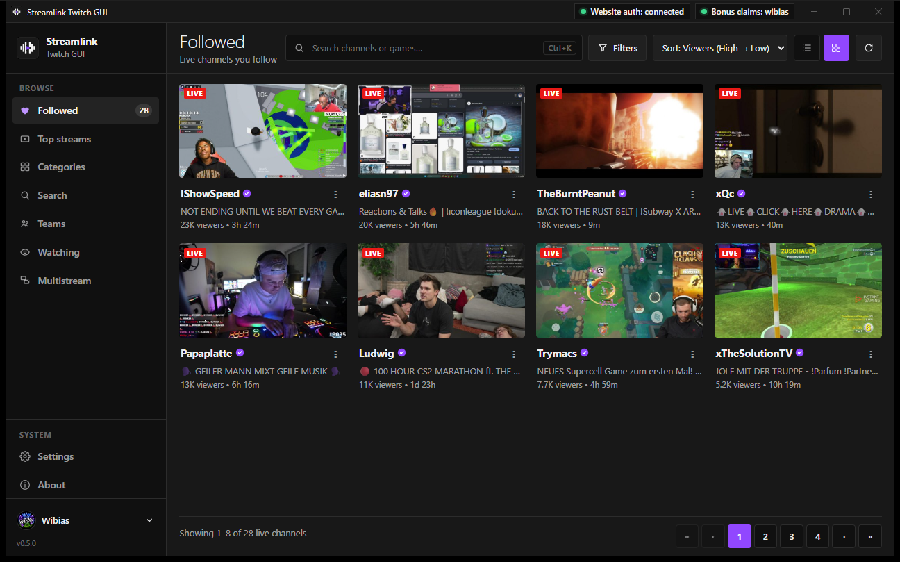
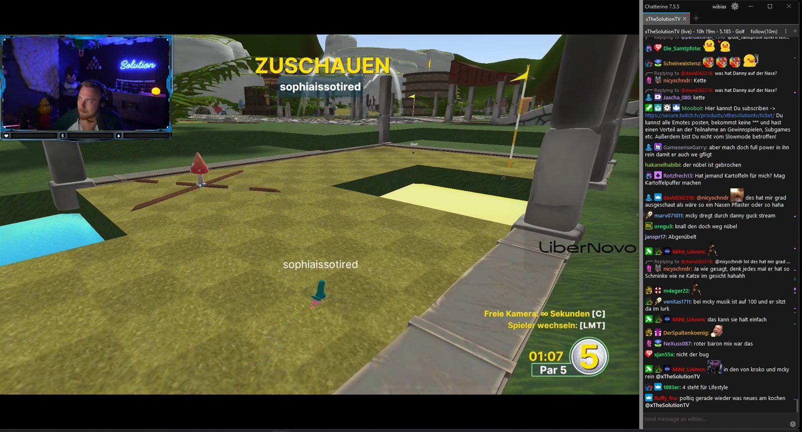
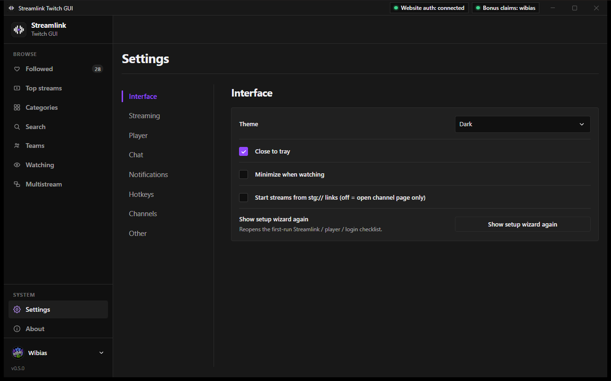
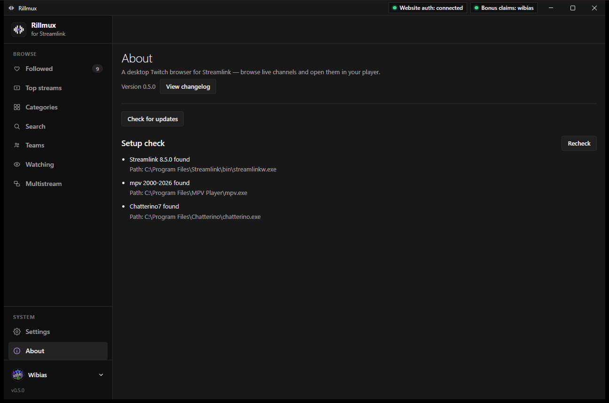

# Rillmux

Windows Twitch browser for [Streamlink](https://streamlink.github.io/). Log in, see who’s live, start the stream in your player, and keep chat next to the video.

The window title, installer, and executable are **Rillmux**.



mpv on the left, [Chatterino7](https://github.com/SevenTV/chatterino7) on the right:



Settings is split into sections rather than one long page:



About includes **View changelog** and a setup check once Streamlink, mpv, and Chatterino have been found:



## What it does

- Twitch login (OAuth Device Code); normal app OAuth tokens live in the OS keyring
- **Website auth** for Streamlink playback; the website token stays in the OS credential manager and is supplied to Streamlink through a randomized ephemeral config only for the launched process. Rillmux does not persist it in the user's `config.twitch`
- Experimental **Channel Points HUD and farming**: live balance, passive watch credit, automatic +50 bonus claims, reward catalog/redemption (including Twitch prompt text), polls, and predictions when enabled in Settings; bonus claims use a separate read-only Twitch TV device session
- Followed (list or grid, search, pins, hide mature), top streams, categories with viewer counts, search, channel pages, teams
- Language filter on top/category streams
- Follow outgoing raids from a prompt over mpv or Chatterino when the raid starts
- Streamlink launch (bundled in release builds, or the system install)
- Watching list with Streamlink status; choose **Independent**, **Seamless**, or **Multistream** opening behavior
- Embedded chat by default, or Chatterino7 / a browser; the docked Chatterino uses an isolated Rillmux-owned profile so unrelated user windows are left alone
- Quality, low latency, ad filter, player, hotkeys, per-channel overrides, tray
- Desktop notifications when followed channels go live (global off switch + per-channel mute)
- First-run setup wizard (Streamlink → player → optional login)
- Auto-updater and `stg://` deep links
- Optional Sentry crash reports (opt-out in Settings)
- Optional category-filtered local Debug Mode diagnostics with bounded `rillmux.log` rotation and local crash files

Release notes: [CHANGELOG.md](CHANGELOG.md).

## Requirements

| Need | Notes |
|------|--------|
| Windows 10/11 | Only supported desktop target |
| [WebView2](https://developer.microsoft.com/microsoft-edge/webview2/) | Usually already installed |
| [Node.js](https://nodejs.org/) 20+ | Develop / CI |
| [Rust](https://rustup.rs/) stable | Tauri backend |
| [mpv](https://mpv.io/installation/) (recommended) | No official Windows installer. In PowerShell: `winget install -e --id shinchiro.mpv`. Or Scoop. Or portable: download `mpv-x86_64-….7z` from [shinchiro builds](https://github.com/shinchiro/mpv-winbuild-cmake/releases), extract, point Settings at `mpv.exe` (keep `ffmpeg.exe` / DLLs beside it). |
| Streamlink | Bundled in **release** installers. For local unsigned builds use a system install or `npm run streamlink:fetch` |
| [Chatterino7](https://github.com/SevenTV/chatterino7) | Optional external chat. Stock Chatterino 2 still launches if found. Chatterino7 is the one that gets 7TV name paints, personal emotes, animated avatars, and 4× 7TV/FFZ images. `winget install -e --id SevenTV.Chatterino7` or [releases](https://github.com/SevenTV/chatterino7/releases/latest). |

## Install

1. Open [Releases](https://github.com/Wibias/Rillmux/releases).
2. Download the NSIS (`.exe`) or MSI installer.
3. If SmartScreen warns (“Unknown publisher”), that is expected until an Authenticode certificate is configured — **More info → Run anyway**, or ship builds signed with your own OV/EV cert (see below).
4. On first launch, finish the setup wizard (Streamlink / player / optional login).

Deep links: `stg://watch/<channel-login>`.

## Develop

```bash
npm install
npm run tauri:dev
```

- `npm run tauri:dev` — desktop app (Vite + Tauri). Use this for login and Streamlink.
- `npm run dev` — Vite only in a browser; no Tauri APIs, so Followed/Helix stay empty.
- `npm test` — unit tests
- `npm run doctor` — full React Doctor scan (CI fails on any finding)
- `npm run streamlink:fetch` — download a Windows Streamlink build into `src-tauri/resources/streamlink/` (gitignored binaries)

Twitch Client ID for local builds: set `TWITCH_CLIENT_ID` / `VITE_TWITCH_CLIENT_ID`, or use the documented env fallback for tryouts. Production releases need your own public Twitch application (Device Code / public client).

## Release (maintainers)

Keep the version in sync in `package.json`, `src-tauri/Cargo.toml`, and `src-tauri/tauri.conf.json` (currently **0.5.9**).

Pushes to `main` or `master` expect a PR with green CI (`frontend`, `rust`, and `react-doctor`). A local `pre-push` hook runs `npm run ci`. Skip it only with `SKIP_CI_HOOK=1`. The Release workflow runs the frontend and rust checks again before building installers.

```bash
git tag v0.5.9
git push origin v0.5.9
```

That runs [`.github/workflows/release.yml`](.github/workflows/release.yml): fetch Streamlink → `tauri build` (NSIS + MSI + updater signatures) → GitHub Release with auto-generated notes. Keep the narrative in [CHANGELOG.md](CHANGELOG.md) in sync when you cut a version.

You can also run the workflow by hand (**Actions → Release → Run workflow**). From `main` or `master` that creates tag `v{version}` (from `package.json`) and publishes the GitHub Release. From any other branch it only uploads artifacts.

### Required GitHub Actions secrets

| Secret | Purpose |
|--------|---------|
| `TAURI_SIGNING_PRIVATE_KEY` | Contents of `src-tauri/gen/updater.key` (updater signing; **never** commit) |
| `TAURI_SIGNING_PRIVATE_KEY_PASSWORD` | Password used when generating that key (empty if none) |
| `TWITCH_CLIENT_ID` | Twitch public client id |
| `VITE_TWITCH_CLIENT_ID` | Same value for the Vite frontend |
| `SENTRY_DSN` | Optional; Rust crash reporting |
| `VITE_SENTRY_DSN` | Optional; same DSN for React |

Updater public key lives in `src-tauri/tauri.conf.json` → `plugins.updater.pubkey`.

### Optional: Windows Authenticode (SmartScreen)

SmartScreen warnings go away only with a **real** code-signing certificate (OV/EV from a public CA, or Azure Trusted Signing). Self-signed certs do not fix SmartScreen.

When you have a `.pfx`:

1. Encode it: `certutil -encode certificate.pfx base64cert.txt` (use the base64 body as the secret value).
2. Add repo secrets:
   - `WINDOWS_CERTIFICATE` — base64 PFX
   - `WINDOWS_CERTIFICATE_PASSWORD` — PFX password
   - `WINDOWS_CERTIFICATE_THUMBPRINT` — SHA1 thumbprint of the cert (no spaces)
3. Release CI imports the PFX into the runner store and sets Tauri’s `bundle.windows` signing fields for that build only.

Without those secrets, releases still build; installers are unsigned.

Timestamp server used when signing: `http://timestamp.digicert.com`.

## Lineage

This is the Tauri rewrite that used to live at [`Wibias/streamlink-twitch-gui`](https://github.com/Wibias/streamlink-twitch-gui) (archived). The original NW.js app is [streamlink/streamlink-twitch-gui](https://github.com/streamlink/streamlink-twitch-gui).

## License

MIT — see [LICENSE](LICENSE).
